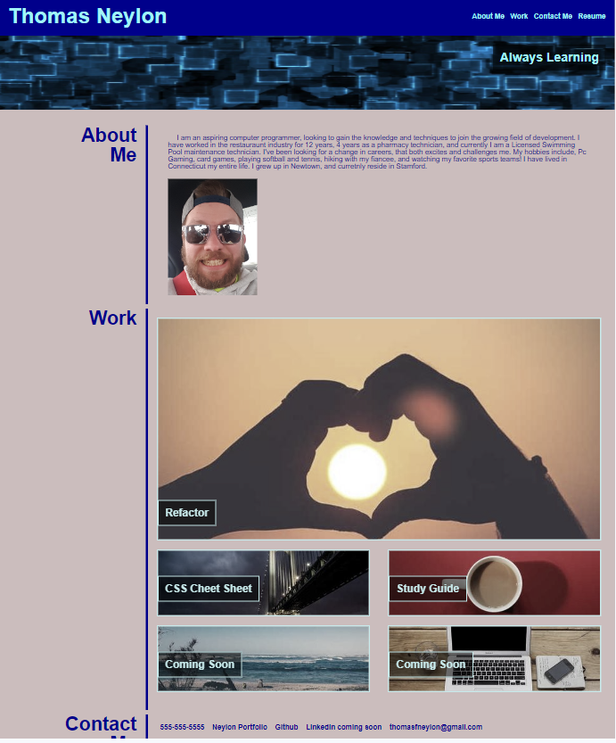
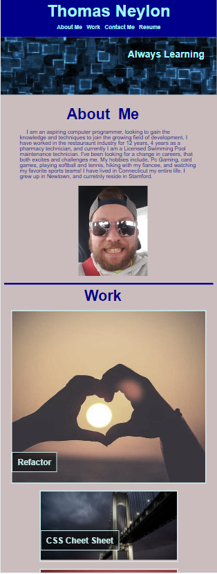

# <Thomas Neylon Portfolio>

## Description
    - There is a need and desire to set potential employers apart and to show case projects and work.
    - This project was built to showcase my work to date, and allows for a place to add new work.
    - This project was able become a place where current and future projects.
    - I learned how create links with image backgrounds, and then to have those links scale to full color upon hovering over them. I also learned about responsive layouts and how to implement these ideas to have the web page change based on viewing screen size to keep the content appealing and engaging. 

## Installation
    Web Page is in the link below
[Horiseon Marketing](https://neglon.github.io/horiseon-refactor)

## Usage
    Upon visiting the page, clicking any of the links on the nav bar on the top right of the page will relocate the your viewing location on the page to the appropriate section. Upon hovering over any of the links in the work section, that link will appear to "light up" as the greyscale goes from 60% to 0%. Clicking on the links with a project name will redirect the browser to a new tab with the project deployed. The coming soon links and links on the page that do not have a location set for future works brings you back to the top of the page. When viewing the page at 768 pixels or below the layout instead of being side by side stacks into a neat column, making it easier to scroll through content.
   

   

   

## Credits
    N/A

## Liscence
    N/A

## Code Source
    
    

    
